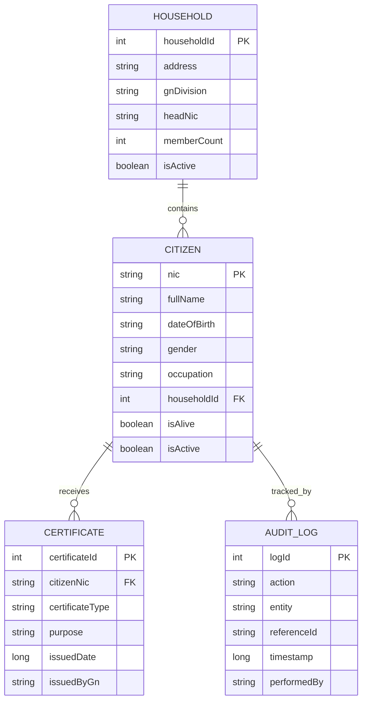

# 🇱🇰 GN Digital Records System

A **Kotlin + Jetpack Compose** based Android application designed to replace
traditional **book-based record keeping** used by **Grama Niladhari offices in Sri Lanka**.

The system is **offline-first**, **secure**, and **easy to use** for non-technical officers.

---

## 🎯 Purpose of the Application

- Replace physical GN record books 📚
- Reduce time taken for citizen services ⏱️
- Prevent data loss and duplication
- Enable fast search and reporting
- Support Sinhala, Tamil, and English 🌐

---

## 🧱 Application Architecture

- **Platform:** Android  
- **Language:** Kotlin  
- **UI:** Jetpack Compose (Material 3)  
- **Architecture:** MVVM  
- **Local Database:** Room (SQLite)  
- **Mode:** Offline-first  

---

## 📂 Project File Structure

```
com.e.gonuva
│
├── MainActivity.kt
├── navigation
│   └── AppNavGraph.kt
├── ui
│   ├── screens
│   │   ├── login/LoginScreen.kt
│   │   ├── dashboard/DashboardScreen.kt
│   │   ├── household/HouseholdScreen.kt
│   │   ├── citizen/CitizenScreen.kt
│   │   ├── certificate/CertificateScreen.kt
│   │   └── settings/SettingsScreen.kt
│   └── theme
│       ├── Color.kt
│       ├── Theme.kt
│       └── Type.kt
│
├── viewmodel
│   ├── AuthViewModel.kt
│   └── LoginState.kt
│
├── data
│   ├── entity
│   │   ├── CitizenEntity.kt
│   │   ├── HouseholdEntity.kt
│   │   ├── CertificateEntity.kt
│   │   └── AuditLogEntity.kt
│   ├── dao
│   │   ├── CitizenDao.kt
│   │   ├── HouseholdDao.kt
│   │   ├── CertificateDao.kt
│   │   └── AuditLogDao.kt
│   └── database
│       └── GNDatabase.kt
└── util
    └── Constants.kt
```

---

## 🔄 How the Application Works

1. **Login**
   - GN logs in using NIC + password
   - Authentication handled by ViewModel

2. **Dashboard**
   - Central navigation hub

3. **Household & Citizen Management**
   - NIC-based citizen records
   - Citizens linked to households

4. **Certificate Issuing**
   - Residence, Income, Character certificates
   - Stored permanently with audit logs

5. **Offline-first**
   - Works without internet
   - Room database used locally

---

## 🗄️ Database ER Diagram



---

## 📐 UI Wireframes (Text-Based)

### 🔐 Login Screen
```
[ GN Digital System ]
NIC Number
[__________]
Password
[__________]
[ LOGIN ]
```

### 🧭 Dashboard
```
[ Add Household ]
[ Add Citizen ]
[ Issue Certificate ]
[ Settings ]
```

---

## ✅ Key Advantages

- Paperless GN office
- Secure & auditable
- Simple UI for all officers
- Scalable nationwide 🇱🇰

---

## 🚀 Future Enhancements

- Biometric login
- Central government sync
- QR verification for certificates

---

## 📌 Conclusion

This system modernizes Grama Niladhari services using reliable,
future-proof Android technologies.
